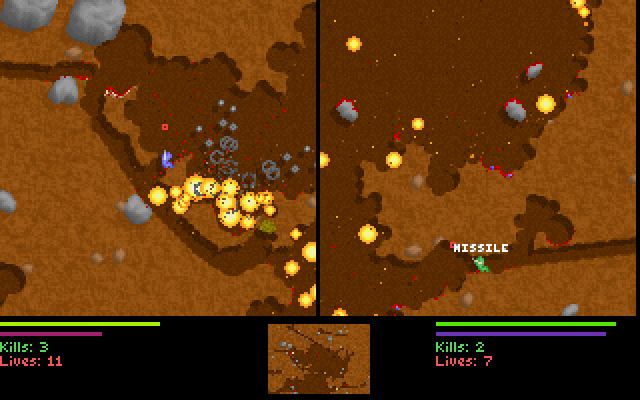
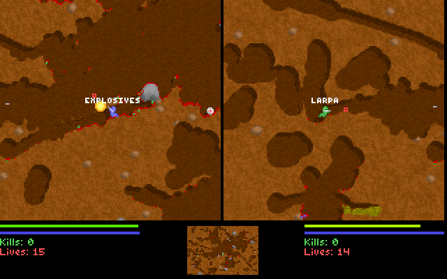

Leiro (Switch-orbmit edition)
=============================

This is the fork of Liero made by and for the Nintendo Switch homebrew community
of Liero players. Compared to Leiro (orbmit edition) it contains:
- Run on the Nintendo Switch

That's right! This is a straight port of the orbmit edition to the Switch. It relies
on libnx and the associated SDL2 implementation.

How to build (Any platform -> Switch)
=====================================

// TODO: Write formal build instructions  
Get pacman with devkitpro repos. If your distro already has pacman, use that and add the dkp repos
to your pacman.conf. Otherwise install dkp-pacman. Use a bit of google here if you don't know how
to do that.  
Make sure that you have libnx, switch-SDL2, switch-SDL2_image, switch-tools, and I think switch-libz
installed to /opt/devkitpro, or wherever your $DEVKITRPO var points. Just install them with pacman
and you should be good to go. If the build still fails, try installing the other switch-SDL2 libs,
maybe something is using them?  
To build, run `make -f Makefile.nx all`.  
Disregard the CMake stuff, that's for building the PC release.  
// TODO?: Redo build with CMake

Screenshots
===========

Here are some screenshots from the DOS version of the game. It looks the same as the port.

OLD README
==========

The original Leiro (orbmit edition) is reproduced below in full, lest we forget
the giants upon whose shoulders we stand.  
Also, because it contains useful information.

Liero (orbmit edition)
========================

This is the fork of Liero made by and for the community of Liero players in
Göteborg. Compared to Liero 1.36 it contains:
- an upgrade to SDL 2
- borderless window fullscreen
- single screen replay. Views the full map in replays
- spectator window. View the full map in a separate window for spectators or streaming
- updated video replay processing
- ability to view spawn point when dead (off by default)
- fix for occasional stuttering

Due to being forked from an unreleased improved version of Liero 1.36, it also
contains the following changes:
- AI improvements
- menu reorganization
- new game mode "Scales of Justice"
- massively improved total conversion support
- various other changes

How to build (Windows)
======================

Building on Windows
-----------------------
* Install Visual Studio 2015
* Install needed packages (SDL2) via nuget
* Copy everything from the pkg directory to the _build directory

(Optional) Dependencies for building the video tool
-----------------------
* Follow the instructions for installing dependencies needed to build ffmpeg. At the time of writing, the MSYS2 route worked best for me https://trac.ffmpeg.org/wiki/CompilationGuide/MinGW
* Download latest libx264: git clone git://git.videolan.org/x264.git
* Build it: cd x264; ./configure --enable-shared --enable-pic && make -j8
* Download latest ffmpeg: git clone git://source.ffmpeg.org/ffmpeg.git ffmpeg
* Build it: cd ffmpeg; ./configure --enable-shared --enable-pic --enable-gpl --enable-libx264 --disable-programs --extra-ldflags=-L../x264 --extra-cflags=-I../x264 && make -j8

How to build (Linux and Mac)
============================

Building on Linux and Mac
-------------------------
* Make sure you have CMake, SDL2, SDL2_image and gcc installed
* Run cmake:
* $ cmake -G "Unix Makefiles"
* Run "make"
* Copy everything from the pkg directory to the root directory used for the build

(Optional) Enabling and building the video tool
-------------------------------
* Download latest libx264: git clone git://git.videolan.org/x264.git
* Build it: cd x264; ./configure --enable-shared --enable-pic && make -j8
* Download latest ffmpeg: git clone git://source.ffmpeg.org/ffmpeg.git ffmpeg
* Build it: cd ffmpeg; ./configure --enable-shared --enable-pic --enable-gpl --enable-libx264 --disable-programs --extra-ldflags=-L../x264 --extra-cflags=-I../x264 --extra-libs=-ldl && make -j8
* Run: make -j8 videotool

Building a release build
---------------------
* Run cmake:
* $ cmake -DCMAKE_BUILD_TYPE=Release -G "Unix Makefiles"
* Run "make"
